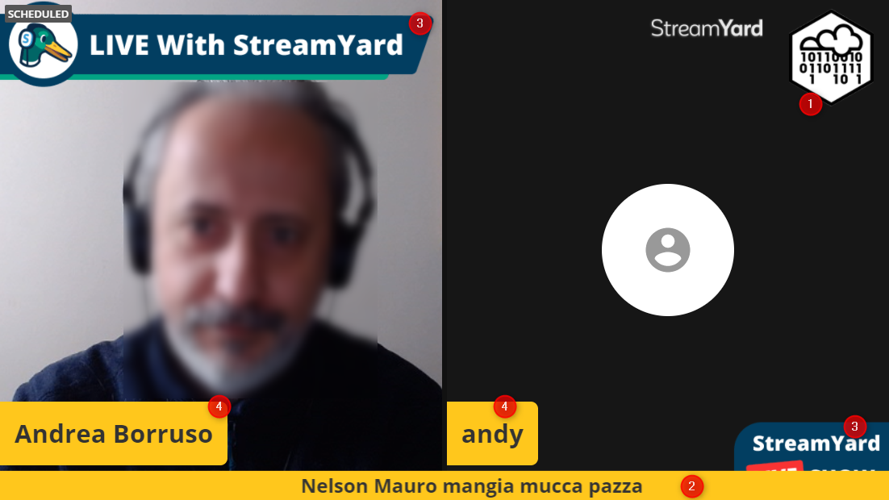
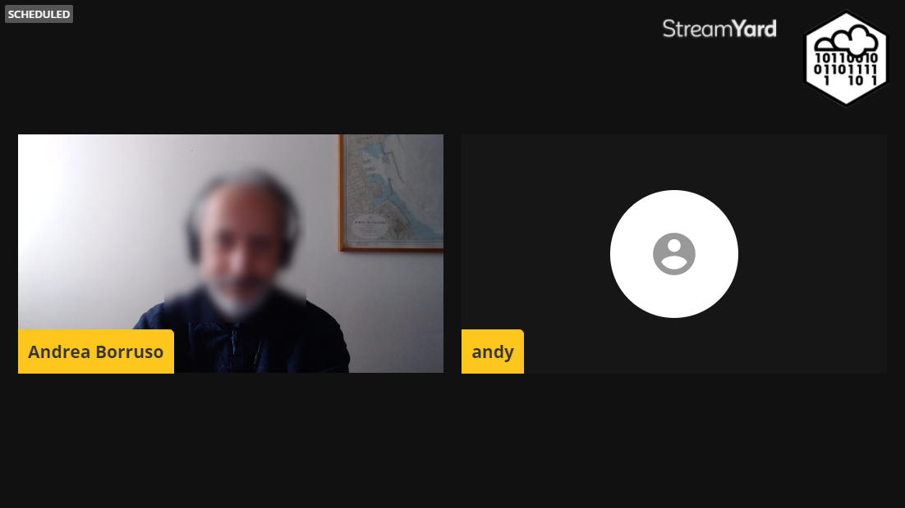
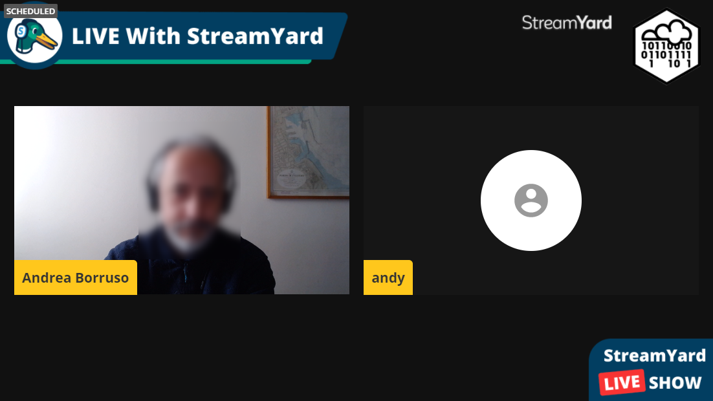
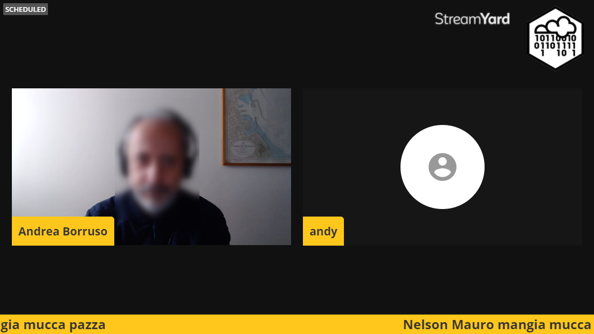

- [da fare](#da-fare)
- [Streamyard](#streamyard)
  - [Grafica da predisporre](#grafica-da-predisporre)
  - [Video già registrati](#video-già-registrati)
  - [Testi scorrevoli da predisporre](#testi-scorrevoli-da-predisporre)
- [Test da fare insieme a chi sarà in regia](#test-da-fare-insieme-a-chi-sarà-in-regia)
- [YouTube](#youtube)

## da fare

- [x] scrivere note StreamYard;
- [x] attivare evento su gruppo Facebook ODS (si può fare soltanto da giorno 10 aprile in poi);
- [x] scrivere documento condiviso per chi si occuperà della regia

## Streamyard

Lo spazio visuale di Streamyard ha queste dimensioni in pixel: `1280 x 720`.

Può contenere al suo interno - oltre i video delle persone - questi 4 oggetti:

1. un logo - dimensioni consigliate, `200 x 200` - che la regia può spegnere ed accendere;
2. un testo (che può opzionalmente scorrere in continuo), che la regia può spegnere ed accendere;
3. una grafica di *overlay*, che va sopra tutto, ad eccezione di 2), che la regia può spegnere ed accendere. Deve essere ovviamente trasparente e di dimensioni `1280 x 720`. È una sola immagine;
4. nomi relatori.

Nota bene:

- **2** e **4** sono testo e si può lavorare soltanto sul colore di sfondo, che al momento è già il giallo del raduno (`#ffc71c`);
- **1** e **3** sono immagini in formato `PNG`;
- la scritta in alto a sinistra - `SCHEDULED` - la vede soltanto la regia, è da considerare non presente.

### Grafica da predisporre

Si possono predisporre:

- [ ] logo ([qui](./template/imgs/logo%20opendatasicilia_esagonale_marginato.svg) c'è SVG);
- [ ] immagine di overlay (non è necessario, è un'opportunità);
- [ ] sfondi.

Uno sfondo può essere utile per queste ragioni principali:

- qualcosa da mettere a schermo intero durante la pausa pranzo;
- qualcosa che sta in sottofondo durante i cambi di scena che farà la regia (si vedrà molto poco);
- qualcosa per aggiungere dei colori, dei segni, in uno degli di visualizzazione di Streamyard che lascia un po' di spazio sopra e sotto le persone.

Un esempio è questo di sotto, con le due strisciate scure sopra e sotto le schermate.

Quindi per progettare uno sfondo in modo che si legga qualcosa nelle due strisciate, basta prendere l'immagine di sotto, ridimensionarla a `1280 x 720`, tenere conto dell'ingombro dei vari spazzi occupati e fare più attenzione agli spazi disponibili.

Ci sono anche queste altre combinazioni:

### Video già registrati

È possibile trasmettere dei video già registrati. Utilizzeremo sicuramente un count-down (ce ne è già pronto uno a 30 secondi).

Non devono superare i 10 minuti e i 200 MB e devono essere 1280 x 720 pixel di dimensioni.

### Testi scorrevoli da predisporre

Così come si può vedere nelle immagini di sopra, è possibile fare scorrere dei testi. A seguire alcuni di quelli predisposti:

- per rimanere aggiornato iscriviti alla newsletter http://opendatasicilia.it/newsletter/
- Dati Pubblici accessibili a tutti, adesso! https://adesso.opendatasicilia.it/
- #datiBeneComune, liberiamoli tutti https://www.datibenecomune.it/

## Test da fare insieme a chi sarà in regia

- [ ] invitare persone
- [ ] ingresso persone
- [ ] gestione inquadrature
- [ ] gestione "grafica"
- [ ] passagio di testimone di regia

## YouTube

URL: <https://www.youtube.com/watch?v=QOd1SKzxRqA>

Titolo: #ODS2021 - Il valore dei dati

Descrizione:

> https://ods2021.opendatasicilia.it/ 
> Il raduno Open Data Sicilia del 2021 ha come obiettivo quello di fare emergere il valore dei dati. 
> Se hai un'idea sui dati aperti, se vuoi scoprire un progetto a cui dare un contributo, imparare a visualizzarli, trasformarli o analizzarli, partecipa.
